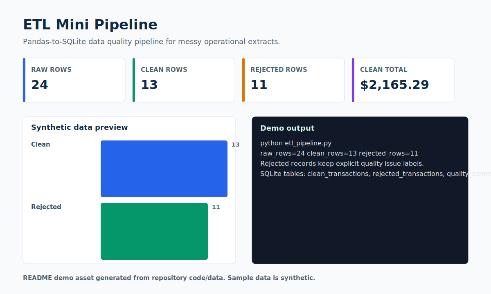

# ETL Mini Pipeline

> A compact data-quality pipeline that turns messy synthetic operations rows into clean SQLite tables.



## Recruiter Snapshot

| 30-second question | Answer |
| --- | --- |
| Problem | Analysts often inherit CSV extracts with duplicate IDs, inconsistent labels, malformed dates, invalid emails, and numeric values stored as text. |
| My role | I wrote the cleaning rules, implemented the pandas transform, preserved rejected rows with issue labels, and loaded curated tables into SQLite. |
| Result | The pipeline processes 24 raw rows into 13 clean rows and 11 rejected rows, with every rejection reason made visible. |
| Portfolio signal | Shows practical data-cleaning judgment, SQL readiness, and responsible handling of imperfect operational data. |
| Data policy | All records are synthetic and safe for a public portfolio. |

## What I Built

- Normalization for categories, statuses, dates, regions, emails, and amounts.
- Rejected-record output with explicit quality issues instead of silent drops.
- SQLite load for clean transactions, rejected transactions, and a quality summary.

## Evidence In This Repo

- `etl_pipeline.py` is the full extract-transform-load workflow.
- `DATA_QUALITY_RULES.md` documents acceptance and rejection rules.
- `raw_data.csv` is intentionally messy and synthetic.

## Tools And Concepts

`Python`, `pandas`, `SQLite`, `ETL`, `data quality`, `validation rules`

## Run Locally

```bash
python -m pip install -r requirements.txt
python etl_pipeline.py
```

## Limitations

The dataset is intentionally small so reviewers can inspect the full pipeline quickly. It is not intended to represent production scale.

## Next Iteration

- Add unit tests for each quality rule.
- Add incremental loading instead of replace loads.
- Add a small data-quality report exported as HTML.

## Data Privacy

Every record, identifier, organization, person, scenario, and result in this project is synthetic unless explicitly marked otherwise. No employer, client, university, colleague, customer, credential, private path, or sensitive personal record is used.
